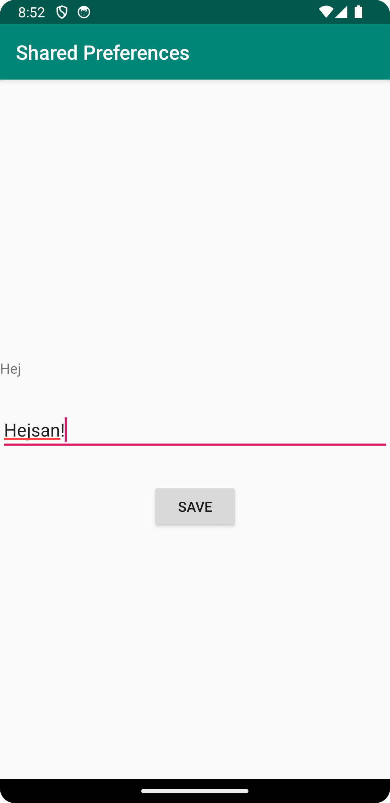
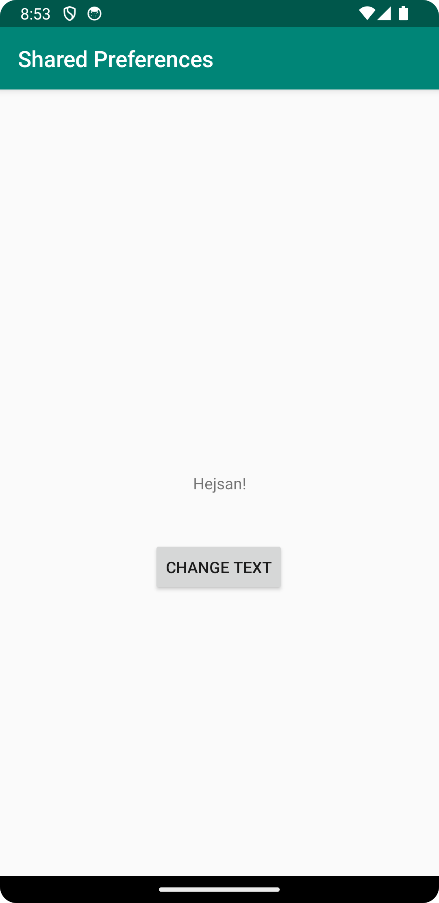

# Rapport

Har skapat en ny layout för en sekundär aktivitet, som innehåller en TextView, EditText, 
och en Button. Den första aktiviteten har en knapp som öppnar den sekundära aktiviteten. I 
den sekundära aktiviteten kan text anges och sedan sparas - den sparade texten visas sedan 
på förstasidan (första aktiviteten).

Kodsnutten nedan hämtar in den text som angivits i den andra aktiviteten genom att använda 
getSharedPreferences. Denna variabel innehåller den information som angivits. Därefter 
kommer TextView i den första aktiviteten att "ersättas" med den sekundära aktiviteten - 
texten från den andra aktiviteten kommer att visas istället.

```
protected void onResume() {
        super.onResume();

        myPreferenceRef = getSharedPreferences("MyAppPreferenceString", MODE_PRIVATE);
        myPreferenceEditor = myPreferenceRef.edit();

        // Read a preference
        TextView prefTextRef=new TextView(this);
        prefTextRef=(TextView)findViewById(R.id.text_view);
        prefTextRef.setText(myPreferenceRef.getString("MyAppPreferenceString", "No preference found."));

    }
```

Bilder läggs i samma mapp som markdown-filen.




Läs gärna:

- Boulos, M.N.K., Warren, J., Gong, J. & Yue, P. (2010) Web GIS in practice VIII: HTML5 and the canvas element for interactive online mapping. International journal of health geographics 9, 14. Shin, Y. &
- Wunsche, B.C. (2013) A smartphone-based golf simulation exercise game for supporting arthritis patients. 2013 28th International Conference of Image and Vision Computing New Zealand (IVCNZ), IEEE, pp. 459–464.
- Wohlin, C., Runeson, P., Höst, M., Ohlsson, M.C., Regnell, B., Wesslén, A. (2012) Experimentation in Software Engineering, Berlin, Heidelberg: Springer Berlin Heidelberg.
